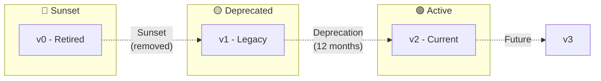

# IrisClassifier - API Documentation

Base URL: `http://localhost:8000/api/v1`

---

## Authentication

All endpoints (except health check) require JWT authentication.

```
Authorization: Bearer <token>
```

### Rate Limiting

| Endpoint Type | Limit | Window |
|---------------|-------|--------|
| General API | 60 requests | 1 minute |
| File Upload | 10 requests | 1 minute |
| Classification | 20 requests | 1 minute |

Response headers:
- `X-RateLimit-Limit`: Maximum requests allowed
- `X-RateLimit-Remaining`: Remaining requests in window
- `X-RateLimit-Reset`: Unix timestamp when limit resets

---

## Endpoints

### Health Check

#### `GET /health`

Check API health status. No authentication required.

**Response**
```json
{
  "status": "healthy",
  "version": "1.0.0",
  "database": "connected",
  "ollama": "available"
}
```

| Status Code | Description |
|-------------|-------------|
| 200 | API is healthy |
| 503 | Service unavailable (database or Ollama down) |

---

## Catalogs

### List Catalogs

#### `GET /catalogs`

Get all catalogs for the authenticated user.

**Query Parameters**

| Parameter | Type | Required | Default | Description |
|-----------|------|----------|---------|-------------|
| `status` | string | No | - | Filter by status: `pending`, `processing`, `completed`, `failed` |
| `limit` | integer | No | 20 | Number of results (max: 100) |
| `offset` | integer | No | 0 | Pagination offset |
| `sort` | string | No | `created_at:desc` | Sort order: `created_at:asc`, `name:asc` |

**Example Request**
```bash
curl -X GET "http://localhost:8000/api/v1/catalogs?status=completed&limit=10" \
  -H "Authorization: Bearer <token>"
```

**Response** `200 OK`
```json
{
  "items": [
    {
      "id": 1,
      "name": "Electronics Catalog 2024",
      "source_file": "electronics.pdf",
      "file_type": "application/pdf",
      "file_size_bytes": 1048576,
      "status": "completed",
      "product_count": 150,
      "created_at": "2024-01-15T10:30:00Z",
      "processed_at": "2024-01-15T10:32:45Z"
    }
  ],
  "total": 25,
  "limit": 10,
  "offset": 0
}
```

---

### Get Catalog

#### `GET /catalogs/{catalog_id}`

Get a single catalog by ID.

**Path Parameters**

| Parameter | Type | Description |
|-----------|------|-------------|
| `catalog_id` | integer | Catalog ID |

**Response** `200 OK`
```json
{
  "id": 1,
  "name": "Electronics Catalog 2024",
  "source_file": "electronics.pdf",
  "file_type": "application/pdf",
  "file_size_bytes": 1048576,
  "status": "completed",
  "product_count": 150,
  "created_at": "2024-01-15T10:30:00Z",
  "processed_at": "2024-01-15T10:32:45Z",
  "processing_logs": [
    {
      "status": "completed",
      "products_extracted": 150,
      "products_classified": 150,
      "processing_time_seconds": 165.5,
      "created_at": "2024-01-15T10:32:45Z"
    }
  ]
}
```

| Status Code | Description |
|-------------|-------------|
| 200 | Catalog found |
| 404 | Catalog not found or not owned by user |

---

### Upload Catalog

#### `POST /catalogs/upload`

Upload a file to create a new catalog. Processing starts automatically.

**Request Headers**
```
Content-Type: multipart/form-data
```

**Request Body**

| Field | Type | Required | Description |
|-------|------|----------|-------------|
| `file` | file | Yes | PDF, Excel, CSV, or image file (max 100MB) |
| `name` | string | No | Catalog name (defaults to filename) |
| `auto_classify` | boolean | No | Whether to classify immediately (default: true) |

**Supported File Types**
- PDF: `application/pdf`
- Excel: `application/vnd.openxmlformats-officedocument.spreadsheetml.sheet`
- CSV: `text/csv`
- Images: `image/jpeg`, `image/png`

**Example Request**
```bash
curl -X POST "http://localhost:8000/api/v1/catalogs/upload" \
  -H "Authorization: Bearer <token>" \
  -F "file=@catalog.pdf" \
  -F "name=Q1 Products"
```

**Response** `202 Accepted`
```json
{
  "id": 5,
  "name": "Q1 Products",
  "status": "processing",
  "message": "Catalog upload accepted. Processing started.",
  "estimated_time_seconds": 30
}
```

| Status Code | Description |
|-------------|-------------|
| 202 | Upload accepted, processing started |
| 400 | Invalid request (missing file, invalid type) |
| 413 | File too large (max 100MB) |
| 415 | Unsupported file type |
| 429 | Rate limit exceeded |

---

### Reclassify Catalog

#### `POST /catalogs/{catalog_id}/reclassify`

Reclassify all products in a catalog using current price ranges.

**Path Parameters**

| Parameter | Type | Description |
|-----------|------|-------------|
| `catalog_id` | integer | Catalog ID |

**Request Body**
```json
{
  "use_ai": true,
  "force": false
}
```

| Field | Type | Required | Default | Description |
|-------|------|----------|---------|-------------|
| `use_ai` | boolean | No | true | Use AI classification (falls back if unavailable) |
| `force` | boolean | No | false | Reclassify even if already classified |

**Response** `202 Accepted`
```json
{
  "catalog_id": 1,
  "status": "processing",
  "products_to_classify": 150,
  "message": "Reclassification started"
}
```

---

## Products

### List Products

#### `GET /products`

Get products with optional filters.

**Query Parameters**

| Parameter | Type | Required | Description |
|-----------|------|----------|-------------|
| `catalog_id` | integer | Yes | Filter by catalog |
| `price_range_id` | integer | No | Filter by price range |
| `min_price` | number | No | Minimum price filter |
| `max_price` | number | No | Maximum price filter |
| `search` | string | No | Full-text search in name |
| `limit` | integer | No | Results per page (default: 50, max: 200) |
| `offset` | integer | No | Pagination offset |
| `sort` | string | No | Sort: `price:asc`, `price:desc`, `name:asc` |

**Example Request**
```bash
curl -X GET "http://localhost:8000/api/v1/products?catalog_id=1&min_price=10&max_price=100&limit=50" \
  -H "Authorization: Bearer <token>"
```

**Response** `200 OK`
```json
{
  "items": [
    {
      "id": 101,
      "catalog_id": 1,
      "name": "Wireless Mouse",
      "price": 29.99,
      "currency": "USD",
      "price_range": {
        "id": 2,
        "name": "Barato",
        "color": "#84cc16"
      },
      "confidence_score": 0.95,
      "classification_method": "ai",
      "created_at": "2024-01-15T10:32:00Z"
    }
  ],
  "total": 150,
  "limit": 50,
  "offset": 0
}
```

---

### Update Product

#### `PATCH /products/{product_id}`

Update a product's details or classification.

**Path Parameters**

| Parameter | Type | Description |
|-----------|------|-------------|
| `product_id` | integer | Product ID |

**Request Body**
```json
{
  "name": "Updated Product Name",
  "price": 45.99,
  "price_range_id": 3
}
```

| Field | Type | Required | Description |
|-------|------|----------|-------------|
| `name` | string | No | Product name |
| `price` | number | No | Product price |
| `price_range_id` | integer | No | Manual classification |

**Response** `200 OK`
```json
{
  "id": 101,
  "name": "Updated Product Name",
  "price": 45.99,
  "price_range": {
    "id": 3,
    "name": "Mediano",
    "color": "#eab308"
  },
  "classification_method": "manual",
  "updated_at": "2024-01-16T08:00:00Z"
}
```

---

### Delete Product

#### `DELETE /products/{product_id}`

Delete a product.

**Response** `204 No Content`

| Status Code | Description |
|-------------|-------------|
| 204 | Product deleted |
| 404 | Product not found |

---

## Price Ranges

### List Price Ranges

#### `GET /price-ranges`

Get all price ranges for the authenticated user.

**Response** `200 OK`
```json
{
  "items": [
    {
      "id": 1,
      "name": "Muy Barato",
      "min_price": 0,
      "max_price": 10,
      "color": "#22c55e",
      "display_order": 1,
      "is_default": true,
      "product_count": 45
    },
    {
      "id": 2,
      "name": "Barato",
      "min_price": 10.01,
      "max_price": 25,
      "color": "#84cc16",
      "display_order": 2,
      "is_default": true,
      "product_count": 78
    }
  ]
}
```

---

### Create Price Range

#### `POST /price-ranges`

Create a new price range.

**Request Body**
```json
{
  "name": "Premium",
  "min_price": 200,
  "max_price": 500,
  "color": "#8b5cf6",
  "display_order": 6
}
```

| Field | Type | Required | Description |
|-------|------|----------|-------------|
| `name` | string | Yes | Unique name for this user |
| `min_price` | number | Yes | Minimum price (inclusive) |
| `max_price` | number | No | Maximum price (null = no limit) |
| `color` | string | No | Hex color code (default: #808080) |
| `display_order` | integer | No | Order in UI (default: auto) |

**Response** `201 Created`
```json
{
  "id": 6,
  "name": "Premium",
  "min_price": 200,
  "max_price": 500,
  "color": "#8b5cf6",
  "display_order": 6,
  "is_default": false,
  "product_count": 0
}
```

| Status Code | Description |
|-------------|-------------|
| 201 | Range created |
| 400 | Invalid data (min > max, duplicate name) |
| 409 | Overlapping range detected (warning only) |

---

### Update Price Range

#### `PUT /price-ranges/{range_id}`

Update a price range.

**Request Body**
```json
{
  "name": "Very Premium",
  "min_price": 250,
  "max_price": 600,
  "color": "#7c3aed",
  "reclassify_products": true
}
```

| Field | Type | Required | Description |
|-------|------|----------|-------------|
| `reclassify_products` | boolean | No | Reclassify affected products (default: false) |

**Response** `200 OK`

---

### Delete Price Range

#### `DELETE /price-ranges/{range_id}`

Delete a price range. Products in this range will become unclassified.

**Response** `204 No Content`

---

## Export

### Export Catalog

#### `GET /catalogs/{catalog_id}/export`

Export catalog products to Excel or PDF.

**Query Parameters**

| Parameter | Type | Required | Default | Description |
|-----------|------|----------|---------|-------------|
| `format` | string | No | `xlsx` | Export format: `xlsx`, `csv`, `pdf` |
| `include_unclassified` | boolean | No | true | Include products without classification |

**Example Request**
```bash
curl -X GET "http://localhost:8000/api/v1/catalogs/1/export?format=xlsx" \
  -H "Authorization: Bearer <token>" \
  -o catalog_export.xlsx
```

**Response** `200 OK`
- Content-Type: `application/vnd.openxmlformats-officedocument.spreadsheetml.sheet`
- Content-Disposition: `attachment; filename="catalog_1_export.xlsx"`

---

## Error Responses

All errors follow this format:

```json
{
  "error": {
    "code": "VALIDATION_ERROR",
    "message": "Human-readable error message",
    "details": {
      "field": "price",
      "issue": "must be a positive number"
    }
  }
}
```

### Error Codes

| Code | HTTP Status | Description |
|------|-------------|-------------|
| `VALIDATION_ERROR` | 400 | Invalid request data |
| `UNAUTHORIZED` | 401 | Missing or invalid token |
| `FORBIDDEN` | 403 | No permission for this resource |
| `NOT_FOUND` | 404 | Resource not found |
| `CONFLICT` | 409 | Resource conflict (duplicate, etc.) |
| `FILE_TOO_LARGE` | 413 | File exceeds size limit |
| `UNSUPPORTED_TYPE` | 415 | File type not supported |
| `RATE_LIMITED` | 429 | Too many requests |
| `AI_UNAVAILABLE` | 503 | Ollama service unavailable |
| `INTERNAL_ERROR` | 500 | Server error |

---

## WebSocket Events (Future)

### `ws://localhost:8000/ws/processing/{catalog_id}`

Real-time processing updates.

**Events**
```json
{"event": "started", "data": {"total_products": 150}}
{"event": "progress", "data": {"processed": 50, "total": 150}}
{"event": "completed", "data": {"classified": 150, "time_seconds": 45.2}}
{"event": "error", "data": {"message": "AI service unavailable", "fallback": true}}
```

---

## SDK Examples

### Python

```python
import requests

class IrisClient:
    """
    Python client for IrisClassifier API.
    
    Example:
        >>> client = IrisClient("http://localhost:8000", "your-token")
        >>> catalogs = client.list_catalogs()
        >>> client.upload_catalog("products.pdf")
    """
    
    def __init__(self, base_url: str, token: str):
        self.base_url = f"{base_url}/api/v1"
        self.session = requests.Session()
        self.session.headers["Authorization"] = f"Bearer {token}"
    
    def list_catalogs(self, status: str = None) -> dict:
        params = {"status": status} if status else {}
        response = self.session.get(f"{self.base_url}/catalogs", params=params)
        response.raise_for_status()
        return response.json()
    
    def upload_catalog(self, file_path: str, name: str = None) -> dict:
        with open(file_path, "rb") as f:
            files = {"file": f}
            data = {"name": name} if name else {}
            response = self.session.post(
                f"{self.base_url}/catalogs/upload",
                files=files,
                data=data
            )
        response.raise_for_status()
        return response.json()
```

### TypeScript

```typescript
/**
 * TypeScript client for IrisClassifier API.
 * 
 * @example
 * const client = new IrisClient('http://localhost:8000', 'your-token');
 * const catalogs = await client.listCatalogs();
 */
class IrisClient {
  private baseUrl: string;
  private token: string;

  constructor(baseUrl: string, token: string) {
    this.baseUrl = `${baseUrl}/api/v1`;
    this.token = token;
  }

  private async fetch<T>(path: string, options?: RequestInit): Promise<T> {
    const response = await fetch(`${this.baseUrl}${path}`, {
      ...options,
      headers: {
        'Authorization': `Bearer ${this.token}`,
        'Content-Type': 'application/json',
        ...options?.headers,
      },
    });
    
    if (!response.ok) {
      throw new Error(`API Error: ${response.status}`);
    }
    
    return response.json();
  }

  async listCatalogs(status?: string): Promise<CatalogList> {
    const params = status ? `?status=${status}` : '';
    return this.fetch(`/catalogs${params}`);
  }

  async getProducts(catalogId: number): Promise<ProductList> {
    return this.fetch(`/products?catalog_id=${catalogId}`);
  }
}
```

---

## API Versioning Strategy

### Versioning Approach

IrisClassifier uses **URL Path Versioning** as the primary versioning strategy. This approach was chosen for:

- **Visibility**: Version is explicit in every request URL
- **Simplicity**: Easy to understand and implement
- **Caching**: Different versions can be cached independently
- **Documentation**: Each version can have separate documentation

```
Base URL Pattern: https://api.irisclassifier.com/api/{version}/
Current Version: v1
```

### Version Lifecycle



| Phase | Duration | Description | Actions Required |
|-------|----------|-------------|------------------|
| **Active** | Ongoing | Current stable version | None - recommended for new integrations |
| **Deprecated** | 12 months | Still functional, but discouraged | Plan migration to new version |
| **Sunset** | 3 months warning | Will be removed | Must migrate before sunset date |
| **Retired** | N/A | No longer available | Requests return 410 Gone |

### Version Headers

All API responses include version-related headers:

```http
HTTP/1.1 200 OK
X-API-Version: v1
X-API-Deprecated: true
X-API-Sunset-Date: 2025-12-31
X-API-Latest-Version: v2
X-API-Migration-Guide: https://docs.irisclassifier.com/migration/v1-to-v2
```

| Header | Description | Example |
|--------|-------------|---------|
| `X-API-Version` | Current version being used | `v1` |
| `X-API-Deprecated` | Whether this version is deprecated | `true` / `false` |
| `X-API-Sunset-Date` | Date when version will be removed (ISO 8601) | `2025-12-31` |
| `X-API-Latest-Version` | Latest available API version | `v2` |
| `X-API-Migration-Guide` | URL to migration documentation | URL |

### Deprecation Notices

When using a deprecated API version, responses include a `Deprecation` header:

```http
HTTP/1.1 200 OK
Deprecation: Sun, 31 Dec 2025 23:59:59 GMT
Link: <https://docs.irisclassifier.com/api/v2>; rel="successor-version"
```

### Breaking vs Non-Breaking Changes

#### Non-Breaking Changes (No Version Bump)

These changes are made to the current version without requiring a new version:

| Change Type | Example | Backward Compatible |
|-------------|---------|---------------------|
| Adding new endpoints | `POST /api/v1/analytics` | ✅ Yes |
| Adding optional fields | New `metadata` field in response | ✅ Yes |
| Adding optional parameters | New `?include_stats=true` query param | ✅ Yes |
| Expanding enums | Adding new status `"archived"` | ✅ Yes |
| Relaxing validation | Allowing longer names | ✅ Yes |
| Bug fixes | Fixing incorrect calculations | ✅ Yes |
| Performance improvements | Faster response times | ✅ Yes |

#### Breaking Changes (Requires Version Bump)

These changes require a new API version:

| Change Type | Example | Migration Path |
|-------------|---------|----------------|
| Removing endpoints | Deleting `DELETE /products` | Use new endpoint or alternative |
| Removing fields | Removing `legacy_id` from response | Update client code |
| Changing field types | `price: string` → `price: number` | Update parsing logic |
| Renaming fields | `catalog_id` → `catalogId` | Update field references |
| Changing authentication | Bearer → API Key | Update auth headers |
| Changing error format | New error response structure | Update error handling |
| Tightening validation | Requiring previously optional field | Ensure field is always sent |

### Version Changelog

#### v1 (Current - Active)

**Released**: 2024-01-15  
**Status**: 🟢 Active  

Initial API release with core functionality:
- Catalog upload and management
- Product extraction and classification
- Price range configuration
- Export capabilities

#### v2 (Planned)

**Target Release**: 2025-Q2  
**Status**: 🔵 In Development  

Planned improvements:
- GraphQL support alongside REST
- Batch operations for bulk updates
- Webhook notifications
- Enhanced filtering with complex queries
- Real-time WebSocket updates

### Migration Guide Template

When a new version is released, a migration guide is provided:

```markdown
# Migration Guide: v1 → v2

## Overview

This guide helps you migrate from API v1 to v2.

**Timeline**:
- v2 Release: 2025-06-01
- v1 Deprecation: 2025-06-01
- v1 Sunset: 2026-06-01

## Breaking Changes

### 1. Product Price Field Type Change

**v1 (deprecated)**:
```json
{
  "price": "29.99"
}
```

**v2 (new)**:
```json
{
  "price": {
    "amount": 29.99,
    "currency": "USD"
  }
}
```

**Migration Steps**:
1. Update your model/type definitions
2. Update parsing logic to handle nested object
3. Test with v2 sandbox environment

### 2. Authentication Header Change

**v1 (deprecated)**:
```http
Authorization: Bearer <token>
```

**v2 (new)**:
```http
X-API-Key: <api-key>
Authorization: Bearer <token>
```

**Migration Steps**:
1. Generate API key in dashboard
2. Add `X-API-Key` header to all requests
3. Keep `Authorization` header for user context

## New Features in v2

- Batch endpoints: `POST /api/v2/products/batch`
- Webhooks: `POST /api/v2/webhooks`
- GraphQL: `POST /api/v2/graphql`
```

### Version Negotiation

Clients can request specific API versions:

#### URL Path (Primary)

```bash
# Explicit version in URL
curl -X GET "https://api.irisclassifier.com/api/v1/products"
curl -X GET "https://api.irisclassifier.com/api/v2/products"
```

#### Accept Header (Optional)

```bash
# Request specific version via header
curl -X GET "https://api.irisclassifier.com/api/products" \
  -H "Accept: application/vnd.iris.v2+json"
```

#### Default Behavior

If no version is specified:
- `/api/products` → Redirects to latest version with `301 Moved Permanently`
- Includes `Location: /api/v2/products` header

### SDK Version Support

| SDK | v1 Support | v2 Support | Notes |
|-----|------------|------------|-------|
| Python `iris-client` | ≥ 1.0.0 | ≥ 2.0.0 | Use `api_version` parameter |
| TypeScript `@iris/api` | ≥ 1.0.0 | ≥ 2.0.0 | Use `IrisClientV2` class |
| CLI `iris-cli` | ≥ 1.0.0 | ≥ 2.0.0 | Use `--api-version` flag |

```python
# Python SDK version selection
from iris_client import IrisClient

# Explicit version
client = IrisClient(api_version="v2")

# Or use version-specific client
from iris_client.v2 import IrisClientV2
client = IrisClientV2(token="your-token")
```

```typescript
// TypeScript SDK version selection
import { IrisClientV1, IrisClientV2 } from '@iris/api';

// v1 client (deprecated)
const v1Client = new IrisClientV1({ token: 'your-token' });

// v2 client (recommended)
const v2Client = new IrisClientV2({ token: 'your-token' });
```

### Testing Against New Versions

A sandbox environment is provided for testing new versions:

```bash
# Production API (v1)
https://api.irisclassifier.com/api/v1/

# Production API (v2)
https://api.irisclassifier.com/api/v2/

# Sandbox (v2 preview)
https://sandbox.irisclassifier.com/api/v2/
```

| Environment | Purpose | Data Persistence | Rate Limits |
|-------------|---------|------------------|-------------|
| Production | Live usage | Permanent | Full limits |
| Sandbox | Testing only | 24-hour retention | Relaxed |

### Monitoring Version Usage

The API tracks version usage for deprecation planning:

```
GET /api/v1/admin/metrics/versions
Authorization: Bearer <admin-token>
```

Response:
```json
{
  "version_usage": {
    "v1": {
      "requests_last_30_days": 1250000,
      "unique_clients": 342,
      "percentage": 45.2
    },
    "v2": {
      "requests_last_30_days": 1520000,
      "unique_clients": 289,
      "percentage": 54.8
    }
  },
  "deprecation_warnings_sent": 156,
  "migration_progress": {
    "completed": 198,
    "in_progress": 87,
    "not_started": 57
  }
}
```

