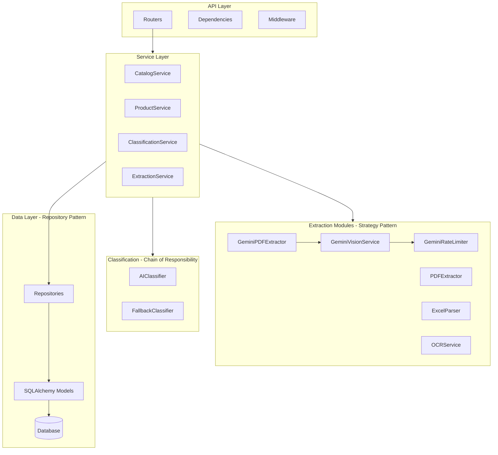

# IrisClassifier - Arquitectura y Patrones de Diseño

Este documento complementa el [IMPLEMENTATION_PLAN.md](./IMPLEMENTATION_PLAN.md) con detalles técnicos de arquitectura, patrones de diseño, y código de referencia.

---

## Diagrama de Componentes



---

## Patrones de Diseño Aplicados

| Patrón | Uso | Beneficio |
|--------|-----|-----------|
| **Repository** | Abstracción de BD | Testing, cambio de BD fácil |
| **Strategy** | Extractores múltiples | Open/Closed Principle |
| **Chain of Responsibility** | AI → Fallback | Fallback automático |
| **Dependency Injection** | FastAPI Depends() | Desacoplamiento |
| **Factory** | Crear extractor por MIME | Extensibilidad |
| **Token Bucket** | GeminiRateLimiter | Rate limiting con backoff exponencial |

---

## Código de Referencia con Logging y SOLID

### 1. Base Extractor (Strategy Pattern)

```python
# backend/services/extractors/base.py
"""
Interfaz base para extractores de archivos.
Implementa el patrón Strategy para manejar diferentes formatos.
"""
from abc import ABC, abstractmethod
from typing import List
import logging

# Configuración de logging estructurado (NO usar print)
logger = logging.getLogger(__name__)


class RawProduct:
    """Value Object para producto extraído sin procesar."""
    
    def __init__(self, name: str, price_text: str, raw_line: str):
        self.name = name
        self.price_text = price_text
        self.raw_line = raw_line


class BaseExtractor(ABC):
    """
    Clase base abstracta para todos los extractores.
    
    Principio SOLID aplicado:
    - Single Responsibility: Solo extrae datos de un formato
    - Open/Closed: Nuevos formatos = nuevas clases, no modificar existentes
    - Liskov Substitution: Todos los extractores son intercambiables
    - Interface Segregation: Interface mínima necesaria
    - Dependency Inversion: Depende de abstracciones
    """
    
    @abstractmethod
    def supports(self, mime_type: str) -> bool:
        """Retorna True si puede procesar este tipo MIME."""
        pass
    
    @abstractmethod
    async def extract(self, content: bytes) -> List[RawProduct]:
        """Extrae productos del contenido del archivo."""
        pass
    
    def _log_extraction_start(self, file_size: int) -> None:
        """Log estructurado al iniciar extracción."""
        logger.info(
            "extraction_started",
            extra={
                "extractor": self.__class__.__name__,
                "file_size_bytes": file_size,
            }
        )
    
    def _log_extraction_complete(self, product_count: int) -> None:
        """Log estructurado al completar extracción."""
        logger.info(
            "extraction_completed",
            extra={
                "extractor": self.__class__.__name__,
                "products_found": product_count,
            }
        )
```

### 1.5. Gemini Vision Service and Rate Limiter

```python
# backend/services/rate_limiter.py
"""
Rate limiter for Gemini API requests.

Implements token bucket algorithm to prevent exceeding API rate limits
and includes retry logic with exponential backoff for 429 errors.
"""
import asyncio
import time
import logging
from typing import Callable, Any, TypeVar, Optional
from config import get_settings

logger = logging.getLogger(__name__)
settings = get_settings()

T = TypeVar('T')


class GeminiRateLimiter:
    """
    Rate limiter using token bucket algorithm.
    
    Ensures requests don't exceed the configured requests per minute.
    Automatically waits before making requests if necessary.
    """
    
    def __init__(self, requests_per_minute: Optional[int] = None):
        self.requests_per_minute = requests_per_minute or settings.gemini_requests_per_minute
        self.min_interval = 60.0 / self.requests_per_minute
        self.last_request_time = 0.0
        self._lock = asyncio.Lock()
    
    async def acquire(self) -> None:
        """Acquire permission to make a request, waiting if necessary."""
        async with self._lock:
            current_time = time.time()
            time_since_last = current_time - self.last_request_time
            
            if time_since_last < self.min_interval:
                wait_time = self.min_interval - time_since_last
                await asyncio.sleep(wait_time)
            
            self.last_request_time = time.time()
    
    async def execute_with_retry(self, func: Callable[..., T], *args, **kwargs) -> T:
        """
        Execute function with automatic retry on rate limit errors.
        
        Uses exponential backoff: 2s, 4s, 8s between retries.
        Falls back gracefully when quota is exhausted.
        """
        max_attempts = settings.gemini_retry_max_attempts
        base_delay = settings.gemini_retry_base_delay
        
        for attempt in range(1, max_attempts + 1):
            try:
                await self.acquire()
                return await func(*args, **kwargs)
            except Exception as e:
                error_msg = str(e).lower()
                is_rate_limit = "429" in error_msg or "quota" in error_msg
                
                if is_rate_limit and attempt < max_attempts:
                    delay = base_delay * (2 ** (attempt - 1))
                    logger.warning(f"Rate limit hit, retrying in {delay}s")
                    await asyncio.sleep(delay)
                    continue
                raise
```

```python
# backend/services/gemini_vision_service.py (excerpt)
"""
Gemini Vision Service for intelligent image analysis.

Uses Google's Gemini 2.0 Flash model for:
- Extracting structured data from catalog images
- Understanding product listings, prices, and descriptions
- Handling various catalog formats automatically
"""

class GeminiVisionService:
    """
    Service for analyzing catalog images using Gemini Vision.
    
    Provides intelligent extraction of products from images,
    understanding layout, tables, and text automatically.
    
    Integrates with GeminiRateLimiter to prevent API throttling.
    """
    
    def __init__(self):
        self._model = None
        self._configured = False
        self._rate_limiter = get_rate_limiter()
    
    async def analyze_image(self, image_data: bytes, mime_type: str = "image/jpeg") -> Dict:
        """
        Analyze an image and extract product information.
        
        Uses rate limiting to prevent 429 errors.
        """
        self._ensure_configured()
        
        # Execute with rate limiting and retry logic
        return await self._rate_limiter.execute_with_retry(
            self._analyze_image_internal,
            image_data,
            mime_type
        )
```

### 2. PDF Extractor (Implementación Strategy)


```python
# backend/services/extractors/pdf_extractor.py
"""
Extractor de productos desde archivos PDF.
Usa pdfplumber para tablas y texto.
"""
import io
import re
import logging
from typing import List, Optional
import pdfplumber
from .base import BaseExtractor, RawProduct

logger = logging.getLogger(__name__)

# Regex robusto para múltiples formatos de precio
# Soporta: $1,234.56 | 1.234,56€ | USD 100 | 100.00
PRICE_PATTERNS = [
    r'\$[\d,]+\.?\d*',           # $1,234.56
    r'[\d.]+,\d{2}\s*€',         # 1.234,56€
    r'USD\s*[\d,]+\.?\d*',       # USD 100.00
    r'[\d,]+\.\d{2}',            # 1,234.56
]


class PDFExtractor(BaseExtractor):
    """
    Extrae productos y precios de archivos PDF.
    
    Maneja casos de borde:
    - PDFs protegidos con contraseña
    - PDFs sin tablas (solo texto)
    - PDFs con múltiples páginas
    - Tablas mal formateadas
    """
    
    def supports(self, mime_type: str) -> bool:
        return mime_type == 'application/pdf'
    
    async def extract(self, content: bytes) -> List[RawProduct]:
        """
        Extrae productos del PDF.
        
        Args:
            content: Bytes del archivo PDF
            
        Returns:
            Lista de productos extraídos
            
        Raises:
            FileProcessingError: Si el PDF está corrupto o protegido
        """
        self._log_extraction_start(len(content))
        products: List[RawProduct] = []
        
        try:
            with pdfplumber.open(io.BytesIO(content)) as pdf:
                # Verificar si el PDF está vacío
                if len(pdf.pages) == 0:
                    logger.warning("pdf_empty", extra={"pages": 0})
                    return products
                
                for page_num, page in enumerate(pdf.pages, 1):
                    # Intentar extraer tablas primero (más estructurado)
                    tables = page.extract_tables()
                    
                    if tables:
                        products.extend(
                            self._extract_from_tables(tables, page_num)
                        )
                    else:
                        # Fallback a extracción de texto
                        text = page.extract_text()
                        if text:
                            products.extend(
                                self._extract_from_text(text, page_num)
                            )
                            
        except Exception as e:
            # Log del error con contexto completo
            logger.error(
                "pdf_extraction_failed",
                extra={
                    "error_type": type(e).__name__,
                    "error_message": str(e),
                },
                exc_info=True  # Incluir stack trace
            )
            raise FileProcessingError(
                message="No se pudo procesar el PDF",
                code="PDF_EXTRACTION_FAILED"
            )
        
        self._log_extraction_complete(len(products))
        return products
    
    def _extract_from_tables(
        self, 
        tables: List[List[List[str]]], 
        page_num: int
    ) -> List[RawProduct]:
        """Extrae productos de tablas del PDF."""
        products = []
        
        for table in tables:
            # Saltar tablas vacías o muy pequeñas
            if not table or len(table) < 2:
                continue
                
            # Intentar detectar columnas de nombre y precio
            header = table[0] if table[0] else []
            name_col, price_col = self._detect_columns(header)
            
            for row in table[1:]:  # Saltar header
                if not row or len(row) <= max(name_col, price_col):
                    continue
                    
                name = self._clean_text(row[name_col])
                price_text = self._clean_text(row[price_col])
                
                if name and price_text:
                    products.append(RawProduct(
                        name=name,
                        price_text=price_text,
                        raw_line=str(row)
                    ))
        
        return products
    
    def _extract_from_text(
        self, 
        text: str, 
        page_num: int
    ) -> List[RawProduct]:
        """Extrae productos de texto plano usando regex."""
        products = []
        lines = text.split('\n')
        
        for line in lines:
            # Buscar precio en la línea
            price_match = self._find_price(line)
            if price_match:
                # El nombre es todo lo que no es el precio
                name = line.replace(price_match, '').strip()
                if len(name) > 2:  # Evitar nombres muy cortos
                    products.append(RawProduct(
                        name=name,
                        price_text=price_match,
                        raw_line=line
                    ))
        
        return products
    
    def _find_price(self, text: str) -> Optional[str]:
        """Busca un precio en el texto usando múltiples patrones."""
        for pattern in PRICE_PATTERNS:
            match = re.search(pattern, text)
            if match:
                return match.group()
        return None
    
    def _detect_columns(self, header: List[str]) -> tuple[int, int]:
        """Detecta columnas de nombre y precio en el header."""
        name_col = 0
        price_col = 1
        
        for i, col in enumerate(header):
            col_lower = (col or '').lower()
            if any(word in col_lower for word in ['nombre', 'producto', 'item', 'name']):
                name_col = i
            if any(word in col_lower for word in ['precio', 'price', 'valor', 'costo']):
                price_col = i
        
        return name_col, price_col
    
    @staticmethod
    def _clean_text(text: Optional[str]) -> str:
        """Limpia y normaliza texto extraído."""
        if not text:
            return ''
        # Remover espacios múltiples y caracteres especiales
        return ' '.join(text.split()).strip()
```

### 3. Classification Service (Chain of Responsibility)

```python
# backend/services/classification_service.py
"""
Servicio de clasificación de productos.
Implementa Chain of Responsibility: AI → Fallback → Manual.
"""
import logging
from typing import List, Optional
from dataclasses import dataclass
from decimal import Decimal

from .ai_classifier import AIClassifier
from .fallback_classifier import FallbackClassifier
from .cache_service import CacheService
from core.exceptions import AIServiceUnavailable

logger = logging.getLogger(__name__)


@dataclass
class ClassificationResult:
    """Resultado de clasificación con metadata."""
    product_id: int
    price_range_id: Optional[int]
    price_range_name: Optional[str]
    method: str  # 'ai', 'fallback', 'manual'
    confidence: float


class ClassificationService:
    """
    Orquesta la clasificación de productos.
    
    Flujo:
    1. Verificar cache → Si existe, retornar
    2. Intentar clasificación IA → Si falla, continuar
    3. Usar clasificación por rangos (fallback)
    
    Principios SOLID:
    - Single Responsibility: Solo clasifica
    - Dependency Inversion: Recibe clasificadores inyectados
    """
    
    def __init__(
        self,
        ai_classifier: AIClassifier,
        fallback_classifier: FallbackClassifier,
        cache: CacheService,
        max_ai_retries: int = 2
    ):
        self._ai = ai_classifier
        self._fallback = fallback_classifier
        self._cache = cache
        self._max_retries = max_ai_retries
    
    async def classify_products(
        self,
        products: List["Product"],
        price_ranges: List["PriceRange"]
    ) -> List[ClassificationResult]:
        """
        Clasifica una lista de productos.
        
        Args:
            products: Lista de productos a clasificar
            price_ranges: Rangos de precio configurados
            
        Returns:
            Lista de resultados de clasificación
        """
        results: List[ClassificationResult] = []
        ai_failures = 0
        
        for product in products:
            try:
                result = await self._classify_single(
                    product, 
                    price_ranges,
                    use_ai=(ai_failures < len(products) * 0.5)  # Desactivar AI si falla mucho
                )
                results.append(result)
                
            except Exception as e:
                # NUNCA fallar silenciosamente - log y continuar
                logger.error(
                    "classification_failed",
                    extra={
                        "product_id": product.id,
                        "product_name": product.name,
                        "error": str(e)
                    },
                    exc_info=True
                )
                # Marcar como no clasificado
                results.append(ClassificationResult(
                    product_id=product.id,
                    price_range_id=None,
                    price_range_name=None,
                    method='error',
                    confidence=0.0
                ))
        
        # Log resumen de clasificación
        methods = [r.method for r in results]
        logger.info(
            "classification_batch_completed",
            extra={
                "total": len(results),
                "by_ai": methods.count('ai'),
                "by_fallback": methods.count('fallback'),
                "errors": methods.count('error'),
            }
        )
        
        return results
    
    async def _classify_single(
        self,
        product: "Product",
        ranges: List["PriceRange"],
        use_ai: bool = True
    ) -> ClassificationResult:
        """Clasifica un solo producto."""
        
        # 1. Verificar cache
        cache_key = self._cache.get_cache_key(
            product.name, 
            product.price
        )
        cached = self._cache.get(cache_key)
        if cached:
            logger.debug("cache_hit", extra={"product_id": product.id})
            return cached
        
        result: Optional[ClassificationResult] = None
        
        # 2. Intentar clasificación con IA
        if use_ai:
            for attempt in range(self._max_retries):
                try:
                    result = await self._ai.classify(product, ranges)
                    result.method = 'ai'
                    break
                except AIServiceUnavailable:
                    logger.warning(
                        "ai_retry",
                        extra={
                            "attempt": attempt + 1,
                            "max_retries": self._max_retries
                        }
                    )
                    if attempt == self._max_retries - 1:
                        logger.warning("ai_unavailable_using_fallback")
        
        # 3. Fallback a clasificación por rangos
        if result is None:
            result = self._fallback.classify(product, ranges)
            result.method = 'fallback'
        
        # 4. Guardar en cache
        self._cache.set(cache_key, result)
        
        return result
```

### 4. Logging Estructurado

```python
# backend/core/logging_config.py
"""
Configuración de logging estructurado.
NO usar print() - siempre usar logger.
"""
import logging
import json
import sys
from datetime import datetime
from typing import Any, Dict


class StructuredFormatter(logging.Formatter):
    """Formatter que produce JSON estructurado para logs."""
    
    def format(self, record: logging.LogRecord) -> str:
        log_entry: Dict[str, Any] = {
            "timestamp": datetime.utcnow().isoformat(),
            "level": record.levelname,
            "logger": record.name,
            "message": record.getMessage(),
        }
        
        # Agregar campos extra (correlation_id, etc.)
        if hasattr(record, '__dict__'):
            for key, value in record.__dict__.items():
                if key not in (
                    'name', 'msg', 'args', 'levelname', 'levelno',
                    'pathname', 'filename', 'module', 'lineno',
                    'funcName', 'created', 'msecs', 'relativeCreated',
                    'thread', 'threadName', 'processName', 'process',
                    'message', 'exc_info', 'exc_text', 'stack_info'
                ):
                    log_entry[key] = value
        
        # Agregar exception info si existe
        if record.exc_info:
            log_entry["exception"] = self.formatException(record.exc_info)
        
        return json.dumps(log_entry)


def setup_logging(level: str = "INFO") -> None:
    """Configura logging para toda la aplicación."""
    root_logger = logging.getLogger()
    root_logger.setLevel(getattr(logging, level.upper()))
    
    # Handler para stdout (producción usa JSON)
    handler = logging.StreamHandler(sys.stdout)
    handler.setFormatter(StructuredFormatter())
    root_logger.addHandler(handler)
    
    # Silenciar loggers muy verbosos
    logging.getLogger("uvicorn.access").setLevel(logging.WARNING)
    logging.getLogger("httpx").setLevel(logging.WARNING)
```

---

## Unit Tests Sugeridos

### Tests para PDFExtractor

```python
# backend/tests/test_pdf_extractor.py
"""
Tests unitarios para PDFExtractor.
Ejecutar: pytest tests/test_pdf_extractor.py -v
"""
import pytest
from io import BytesIO
from unittest.mock import Mock, patch
from services.extractors.pdf_extractor import PDFExtractor, RawProduct


class TestPDFExtractor:
    """Tests para PDFExtractor."""
    
    @pytest.fixture
    def extractor(self):
        return PDFExtractor()
    
    # --- Test: supports() ---
    
    def test_supports_pdf_mime_type(self, extractor):
        """Debe soportar application/pdf."""
        assert extractor.supports('application/pdf') is True
    
    def test_does_not_support_other_types(self, extractor):
        """No debe soportar otros tipos MIME."""
        assert extractor.supports('image/png') is False
        assert extractor.supports('text/plain') is False
    
    # --- Test: _find_price() ---
    
    @pytest.mark.parametrize("text,expected", [
        ("Producto ABC $19.99", "$19.99"),
        ("Item XYZ 1.234,56€", "1.234,56€"),
        ("USD 100.00 por unidad", "USD 100.00"),
        ("Precio: 45.99", "45.99"),
        ("Sin precio aquí", None),
    ])
    def test_find_price_patterns(self, extractor, text, expected):
        """Debe encontrar precios en diferentes formatos."""
        result = extractor._find_price(text)
        assert result == expected
    
    # --- Test: _clean_text() ---
    
    def test_clean_text_removes_extra_spaces(self, extractor):
        """Debe normalizar espacios."""
        result = extractor._clean_text("  Producto   con   espacios  ")
        assert result == "Producto con espacios"
    
    def test_clean_text_handles_none(self, extractor):
        """Debe manejar None sin error."""
        assert extractor._clean_text(None) == ""
    
    # --- Test: extract() casos de borde ---
    
    @pytest.mark.asyncio
    async def test_extract_empty_pdf(self, extractor):
        """Debe retornar lista vacía para PDF sin páginas."""
        # Mock de PDF vacío
        with patch('pdfplumber.open') as mock_open:
            mock_pdf = Mock()
            mock_pdf.pages = []
            mock_open.return_value.__enter__ = Mock(return_value=mock_pdf)
            mock_open.return_value.__exit__ = Mock(return_value=False)
            
            result = await extractor.extract(b'fake_pdf_content')
            assert result == []
    
    @pytest.mark.asyncio
    async def test_extract_corrupted_pdf_raises_error(self, extractor):
        """Debe lanzar FileProcessingError para PDF corrupto."""
        with patch('pdfplumber.open', side_effect=Exception("PDF corrupto")):
            with pytest.raises(FileProcessingError):
                await extractor.extract(b'corrupted_content')


class TestClassificationService:
    """Tests para ClassificationService."""
    
    @pytest.fixture
    def mock_ai_classifier(self):
        return Mock()
    
    @pytest.fixture
    def mock_fallback_classifier(self):
        return Mock()
    
    @pytest.fixture
    def mock_cache(self):
        cache = Mock()
        cache.get.return_value = None  # Cache miss por defecto
        return cache
    
    @pytest.fixture
    def service(self, mock_ai_classifier, mock_fallback_classifier, mock_cache):
        return ClassificationService(
            ai_classifier=mock_ai_classifier,
            fallback_classifier=mock_fallback_classifier,
            cache=mock_cache
        )
    
    @pytest.mark.asyncio
    async def test_uses_cache_when_available(self, service, mock_cache):
        """Debe usar resultado cacheado si existe."""
        cached_result = ClassificationResult(
            product_id=1,
            price_range_id=1,
            price_range_name="Barato",
            method="ai",
            confidence=0.95
        )
        mock_cache.get.return_value = cached_result
        
        product = Mock(id=1, name="Test", price=Decimal("10.00"))
        ranges = [Mock()]
        
        results = await service.classify_products([product], ranges)
        
        assert len(results) == 1
        assert results[0] == cached_result
    
    @pytest.mark.asyncio
    async def test_fallback_when_ai_unavailable(
        self, service, mock_ai_classifier, mock_fallback_classifier
    ):
        """Debe usar fallback si AI no está disponible."""
        mock_ai_classifier.classify.side_effect = AIServiceUnavailable()
        mock_fallback_classifier.classify.return_value = ClassificationResult(
            product_id=1,
            price_range_id=2,
            price_range_name="Mediano",
            method="fallback",
            confidence=1.0
        )
        
        product = Mock(id=1, name="Test", price=Decimal("25.00"))
        ranges = [Mock()]
        
        results = await service.classify_products([product], ranges)
        
        assert results[0].method == "fallback"
        mock_fallback_classifier.classify.assert_called_once()
```

### Tests para Frontend (Vitest)

```typescript
// frontend/src/hooks/__tests__/useCamera.test.ts
import { renderHook, act } from '@testing-library/react';
import { describe, it, expect, vi, beforeEach } from 'vitest';
import { useCamera } from '../useCamera';

// Mock de Capacitor Camera
vi.mock('@capacitor/camera', () => ({
  Camera: {
    getPhoto: vi.fn(),
  },
  CameraResultType: { Base64: 'base64' },
  CameraSource: { Camera: 'camera', Photos: 'photos' },
}));

import { Camera } from '@capacitor/camera';

describe('useCamera', () => {
  beforeEach(() => {
    vi.clearAllMocks();
  });

  it('should return base64 string on successful photo capture', async () => {
    const mockBase64 = 'iVBORw0KGgoAAAANSUhEUgAAAAEAAAABCAYAAAAfFcSJAAAADUlEQVR42mNk';
    
    vi.mocked(Camera.getPhoto).mockResolvedValue({
      base64String: mockBase64,
      format: 'jpeg',
    });

    const { result } = renderHook(() => useCamera());

    let photo: string | null = null;
    await act(async () => {
      photo = await result.current.takePhoto();
    });

    expect(photo).toBe(mockBase64);
    expect(result.current.error).toBeNull();
  });

  it('should set error when camera access fails', async () => {
    vi.mocked(Camera.getPhoto).mockRejectedValue(new Error('Permission denied'));

    const { result } = renderHook(() => useCamera());

    await act(async () => {
      await result.current.takePhoto();
    });

    expect(result.current.error).toBe('No se pudo acceder a la cámara');
  });

  it('should set isLoading during photo capture', async () => {
    vi.mocked(Camera.getPhoto).mockImplementation(
      () => new Promise((resolve) => setTimeout(resolve, 100))
    );

    const { result } = renderHook(() => useCamera());

    act(() => {
      result.current.takePhoto();
    });

    expect(result.current.isLoading).toBe(true);
  });
});
```

---

## Comandos para Ejecutar Tests

```bash
# Backend (pytest)
cd backend
python -m pytest tests/ -v --cov=services --cov-report=html

# Tests específicos
python -m pytest tests/test_pdf_extractor.py -v
python -m pytest tests/test_classification_service.py -v -k "fallback"

# Frontend (Vitest)
cd frontend
npm run test              # Watch mode
npm run test:coverage     # Con cobertura
npm run test -- --run     # Single run (CI)
```

---

## Próximos Pasos

1. Revisar este documento de arquitectura
2. Aprobar el plan principal en [IMPLEMENTATION_PLAN.md](./IMPLEMENTATION_PLAN.md)
3. Comenzar implementación con la estructura definida
