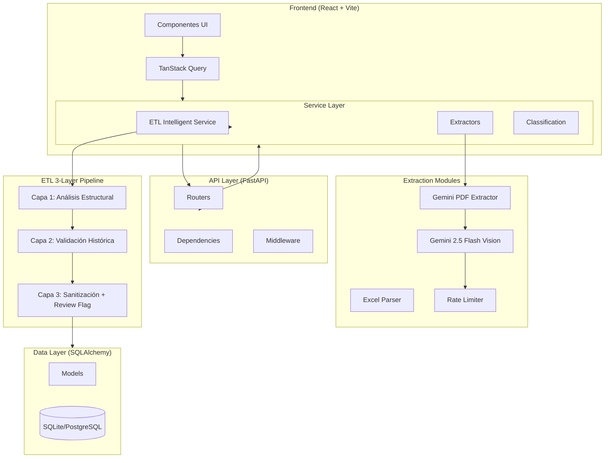
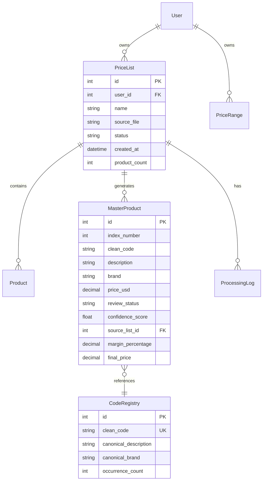
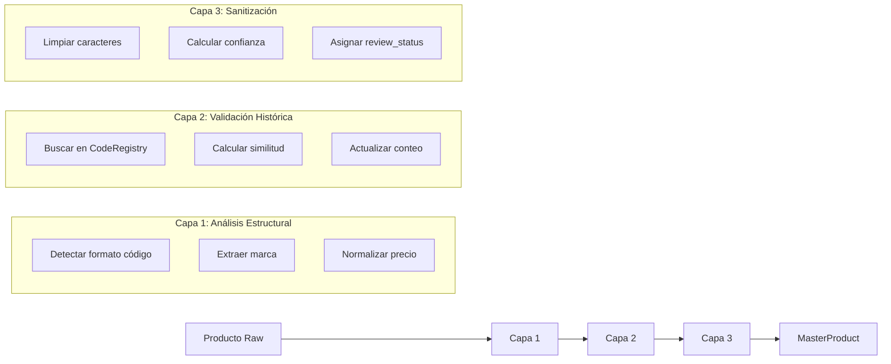

# IrisClassifier - Arquitectura del Sistema

Este documento describe la arquitectura técnica y patrones de diseño del sistema.

---

## Diagrama de Componentes



---

## Estructura de Directorios

```
iridescent-gravity/
├── backend/
│   ├── api/
│   │   └── v1/
│   │       ├── routers/
│   │       │   ├── lists.py         # Gestión de listas de precios
│   │       │   ├── products.py      # CRUD de productos
│   │       │   ├── master_table.py  # Gestión Listados (Master Table)
│   │       │   ├── upload.py        # Upload con ETL
│   │       │   └── ...
│   │       └── schemas/
│   │           └── schemas.py       # Pydantic schemas
│   ├── database/
│   │   ├── models.py                # SQLAlchemy models
│   │   └── connection.py            # DB connection
│   ├── services/
│   │   ├── etl_intelligent_service.py  # ETL 3-capas
│   │   ├── gemini_vision_service.py    # Gemini 2.5 Flash
│   │   ├── rate_limiter.py             # Rate limiting
│   │   ├── extractors/
│   │   │   ├── base.py
│   │   │   ├── gemini_pdf_extractor.py
│   │   │   ├── excel_parser.py
│   │   │   └── ...
│   │   └── ...
│   └── main.py
├── frontend/
│   └── src/
│       ├── pages/
│       │   ├── ListsManager.tsx       # Gestión de listas
│       │   ├── ListingsManagement.tsx # Master Table UI
│       │   ├── Products.tsx
│       │   └── ...
│       ├── services/
│       │   ├── api.ts
│       │   └── queries.ts             # TanStack Query hooks
│       └── App.tsx
└── docs/
```

---

## Modelos de Datos

### Entidades Principales



---

## Patrones de Diseño

| Patrón | Uso | Beneficio |
|--------|-----|-----------|
| **Strategy** | Extractores múltiples | Extensibilidad |
| **Chain of Responsibility** | ETL 3-capas | Pipeline flexible |
| **Repository** | Abstracción de BD | Testing fácil |
| **Dependency Injection** | FastAPI Depends() | Desacoplamiento |
| **Token Bucket** | Rate Limiter Gemini | Manejo de cuotas |

---

## ETL Intelligent Service

### Pipeline de 3 Capas



### Flujo de Confianza

| Confianza | Status | Acción UI |
|-----------|--------|-----------|
| ≥ 80% | `confirmed` | Aprobado automáticamente |
| < 80% | `pending` | Indicador ⚠️, requiere revisión |
| Usuario rechaza | `rejected` | Marcado como rechazado |

---

## API Endpoints

### Estructura Base

```
/api/v1/
├── /auth/           # Autenticación
├── /lists/          # Listas de precios (antes /catalogs)
│   ├── GET          # Listar
│   ├── POST/upload  # Subir con ETL
│   └── DELETE/{id}  # Eliminar
├── /products/       # Productos legacy
├── /master-products/# Master Table
│   ├── GET          # Listar con filtros
│   ├── GET/stats    # Estadísticas heatmap
│   ├── GET/export   # Exportar PDF/Excel
│   └── PATCH/{id}/* # Actualizar campos
└── /price-ranges/   # Rangos de precio
```

---

## Frontend

### Estructura de Componentes

```
App
├── Navigation
├── ListsManager (Subir Listas)
│   ├── UploadSection
│   └── ListsGrid
├── Products (Vista por Lista)
│   └── ProductsTable
└── ListingsManagement (Master Table)
    ├── ViewControls (Enterprise/Client)
    ├── FiltersBar
    ├── MasterTable (con Heatmap)
    └── ExportButtons
```

### TanStack Query Hooks

```typescript
// Listas
useLists()           // Listar
useUploadList()      // Subir
useDeleteList()      // Eliminar

// Master Table
useMasterProducts()  // Listar con filtros
usePriceStats()      // Estadísticas
useUpdateMargin()    // Actualizar %
useUpdateFinalPrice()// Actualizar precio
```

---

## Gemini 2.5 Flash Integration

### Rate Limiting

```python
class GeminiRateLimiter:
    requests_per_minute: int = 10
    retry_max_attempts: int = 3
    retry_base_delay: float = 2.0
    
    # Exponential backoff on 429
    # 2s -> 4s -> 8s
```

### Uso Optimizado

- **PDFs**: 1 API call por documento (no por página)
- **Fallback**: OCR tradicional si quota agotada
- **Batching**: Páginas procesadas en lotes de 5

---

## Monitoreo

### Prometheus Metrics

```
iris_http_requests_total
iris_http_request_duration_seconds
iris_products_extracted_total
iris_gemini_api_calls_total
iris_gemini_rate_limit_hits_total
```

### Health Check

```
GET /health
{
  "status": "healthy",
  "version": "1.0.0",
  "database": "connected"
}
```

---

## Despliegue

### Docker Compose

```yaml
services:
  backend:
    build: ./backend
    environment:
      - GEMINI_API_KEY=${GEMINI_API_KEY}
  frontend:
    build: ./frontend
  db:
    image: postgres:15
```

### Variables de Entorno

| Variable | Requerida | Descripción |
|----------|-----------|-------------|
| `GEMINI_API_KEY` | Sí | API key de Gemini |
| `SECRET_KEY` | Sí | JWT secret |
| `DATABASE_URL` | No | Default: SQLite |
