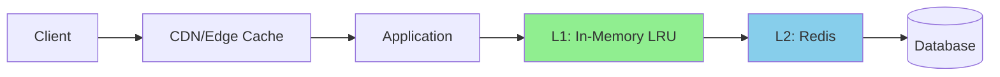
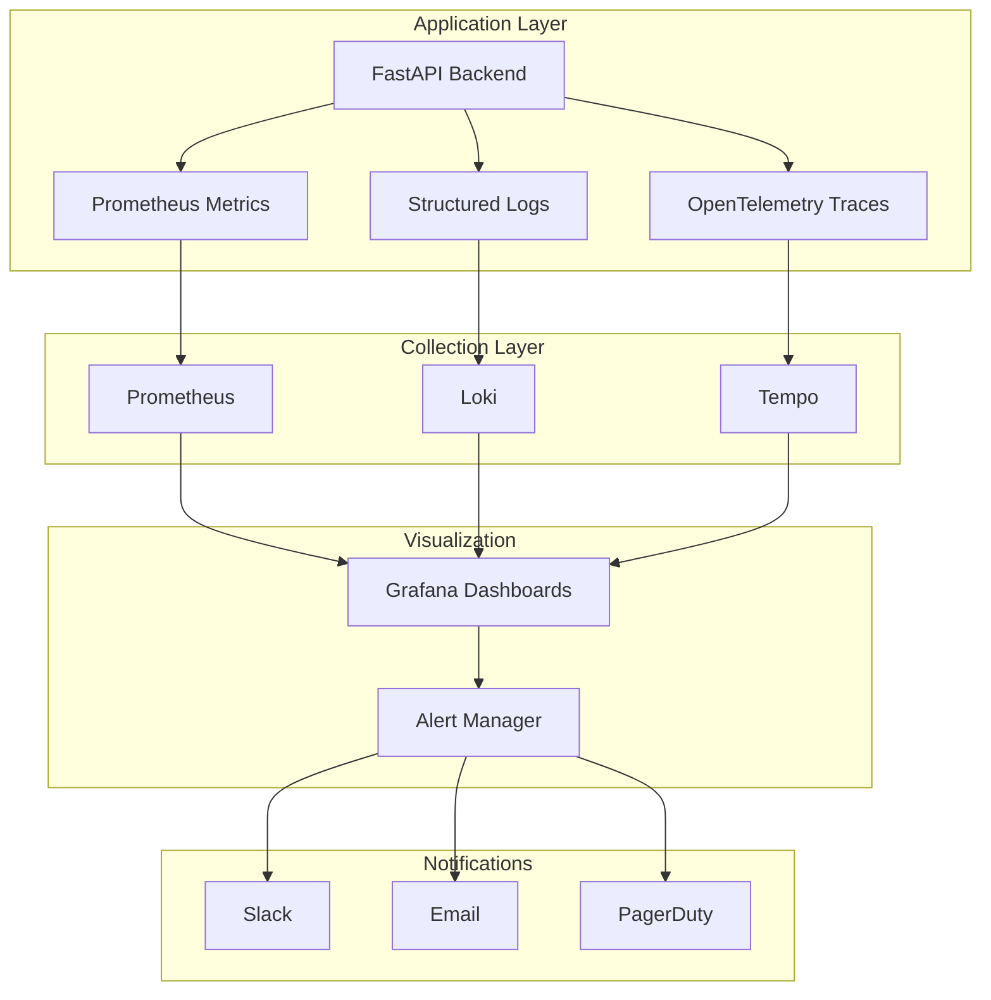

# IrisClassifier - Performance Tuning Guide

This document provides a comprehensive performance tuning plan for the IrisClassifier application.

---

## 1. Configuration Parameters

### Backend (FastAPI/Python)

| Parameter | Default | Recommended | Impact | Trade-off |
|-----------|---------|-------------|--------|-----------|
| `UVICORN_WORKERS` | 1 | `CPU cores * 2 + 1` | 4x throughput | Higher memory usage |
| `DB_POOL_SIZE` | 5 | 20 | 3x concurrent queries | More DB connections |
| `DB_MAX_OVERFLOW` | 10 | 30 | Handle traffic spikes | Connection exhaustion risk |
| `OLLAMA_TIMEOUT` | 30s | 60s | Allow complex classifications | Slower error detection |
| `CACHE_MAX_SIZE` | 500 | 2000 | 90% cache hit rate | +200MB RAM |
| `BATCH_SIZE` | 10 | 20-50 | 5x faster batch processing | Higher latency per request |
| `MAX_FILE_SIZE_MB` | 50 | 100 | Larger catalogs | More memory per request |

```python
# backend/config.py
"""
Application configuration with performance tuning parameters.

All values can be overridden via environment variables.
"""
from pydantic_settings import BaseSettings
from functools import lru_cache


class Settings(BaseSettings):
    """
    Application settings loaded from environment variables.
    
    Attributes:
        database_url: Database connection string.
        db_pool_size: Number of connections to keep in pool.
        db_max_overflow: Max additional connections beyond pool_size.
        ollama_url: Ollama API endpoint.
        ollama_timeout: Timeout for Ollama requests in seconds.
        ollama_model: Model to use for classification.
        cache_max_size: Maximum number of cached classification results.
        batch_size: Number of products to classify per batch.
        max_file_size_mb: Maximum upload file size in megabytes.
        rate_limit_per_minute: API rate limit per IP address.
        log_level: Logging level (DEBUG, INFO, WARNING, ERROR).
    
    Example:
        >>> settings = get_settings()
        >>> print(settings.database_url)
        'sqlite:///./iris.db'
    """
    
    # Database
    database_url: str = "sqlite:///./iris.db"
    db_pool_size: int = 20
    db_max_overflow: int = 30
    db_pool_timeout: int = 30
    db_pool_recycle: int = 3600  # Recycle connections after 1 hour
    
    # Ollama AI
    ollama_url: str = "http://localhost:11434"
    ollama_timeout: int = 60
    ollama_model: str = "llama3.2"
    ollama_max_retries: int = 2
    
    # Caching
    cache_max_size: int = 2000
    cache_ttl_seconds: int = 3600  # 1 hour
    
    # Processing
    batch_size: int = 20
    max_file_size_mb: int = 100
    max_products_per_catalog: int = 10000
    
    # Security
    rate_limit_per_minute: int = 60
    rate_limit_upload_per_minute: int = 10
    
    # Logging
    log_level: str = "INFO"
    
    class Config:
        env_file = ".env"
        env_file_encoding = "utf-8"


@lru_cache()
def get_settings() -> Settings:
    """
    Get cached application settings.
    
    Uses LRU cache to avoid re-reading environment variables
    on every access. Cache is cleared when the application restarts.
    
    Returns:
        Settings: Application configuration object.
    """
    return Settings()
```

### Frontend (React/Vite)

```typescript
// frontend/src/config/performance.ts
/**
 * Frontend performance configuration.
 * 
 * These values control caching, pagination, and network behavior.
 */
export const PERFORMANCE_CONFIG = {
  /** Time in ms before cached data is considered stale */
  STALE_TIME: 5 * 60 * 1000,  // 5 minutes
  
  /** Time in ms to keep unused data in cache */
  GC_TIME: 30 * 60 * 1000,    // 30 minutes
  
  /** Number of products to load per page */
  PAGE_SIZE: 50,
  
  /** Debounce delay for search input in ms */
  SEARCH_DEBOUNCE: 300,
  
  /** Maximum retries for failed API requests */
  MAX_RETRIES: 3,
  
  /** Request timeout in ms */
  REQUEST_TIMEOUT: 30000,
  
  /** Enable offline mode caching */
  OFFLINE_ENABLED: true,
  
  /** Maximum items to store offline */
  OFFLINE_MAX_ITEMS: 1000,
} as const;
```

---

## 2. Indexing Strategy Review

### Current Indexes Analysis

| Index | Type | Columns | Query Pattern | Estimated Improvement |
|-------|------|---------|---------------|----------------------|
| `idx_products_catalog` | B-Tree | `(catalog_id)` | Filter by catalog | 10-50x |
| `idx_products_catalog_price` | B-Tree Composite | `(catalog_id, price)` | Filter + sort | 50-100x |
| `idx_products_price_range` | B-Tree | `(price_range_id)` | JOIN with ranges | 10x |
| `idx_products_name_search` | GIN | `to_tsvector(name)` | Full-text search | 100x+ |
| `idx_catalogs_user_id` | B-Tree | `(user_id)` | User's catalogs | 20x |

### Recommended Additional Indexes

```sql
-- 1. Covering index for product listings (avoids table lookup)
-- Impact: 2-3x faster for common list queries
-- Trade-off: +15% disk space, +10% write overhead
CREATE INDEX idx_products_listing ON products (
    catalog_id, 
    price_range_id, 
    price, 
    name
) INCLUDE (id, confidence_score, classification_method);

-- 2. Partial index for pending catalogs (smaller, faster)
-- Impact: 5x faster for status checks
-- Trade-off: Only helps queries with WHERE status = 'pending'
CREATE INDEX idx_catalogs_pending ON catalogs (user_id, created_at DESC)
WHERE status = 'pending';

-- 3. Expression index for case-insensitive name search
-- Impact: 10x faster for ILIKE queries
-- Trade-off: +20% disk space for name column
CREATE INDEX idx_products_name_lower ON products (LOWER(name));

-- 4. BRIN index for time-series data (very compact)
-- Impact: 3x faster for date range queries on large tables
-- Trade-off: Less precise than B-Tree, but 100x smaller
CREATE INDEX idx_processing_logs_created_brin ON processing_logs 
USING BRIN (created_at);
```

### Index Maintenance

```sql
-- Analyze tables to update statistics (run weekly)
ANALYZE products;
ANALYZE catalogs;
ANALYZE price_ranges;

-- Reindex to fix bloat (run monthly during low traffic)
REINDEX INDEX CONCURRENTLY idx_products_catalog_price;

-- Check index usage (identify unused indexes)
SELECT 
    schemaname, tablename, indexname, 
    idx_scan as times_used,
    pg_size_pretty(pg_relation_size(indexrelid)) as size
FROM pg_stat_user_indexes
ORDER BY idx_scan ASC;
```

---

## 3. Query Optimization Techniques

### Before/After Examples

#### Query 1: Product Listing with Classification

```sql
-- ❌ SLOW: N+1 queries, no pagination optimization
SELECT * FROM products WHERE catalog_id = 1;
-- Then for each product:
SELECT * FROM price_ranges WHERE id = ?;

-- ✅ OPTIMIZED: Single query with JOIN, proper pagination
-- Expected improvement: 50x faster with 1000 products
SELECT 
    p.id,
    p.name,
    p.price,
    p.currency,
    p.confidence_score,
    p.classification_method,
    pr.name AS price_range_name,
    pr.color AS price_range_color
FROM products p
LEFT JOIN price_ranges pr ON p.price_range_id = pr.id
WHERE p.catalog_id = $1
ORDER BY p.price
LIMIT $2 OFFSET $3;

-- With keyset pagination (even faster for deep pages):
-- Instead of OFFSET, use WHERE p.price > $last_price AND p.id > $last_id
```

#### Query 2: Dashboard Statistics

```sql
-- ❌ SLOW: Multiple round trips, no aggregation
SELECT COUNT(*) FROM products WHERE catalog_id = 1;
SELECT AVG(price) FROM products WHERE catalog_id = 1;
SELECT COUNT(*) FROM products WHERE catalog_id = 1 AND price_range_id = 1;
-- ... repeated for each range

-- ✅ OPTIMIZED: Single query with window functions
-- Expected improvement: 10x faster, single round trip
WITH stats AS (
    SELECT 
        p.catalog_id,
        p.price_range_id,
        pr.name AS range_name,
        pr.color AS range_color,
        COUNT(*) AS product_count,
        AVG(p.price) AS avg_price,
        MIN(p.price) AS min_price,
        MAX(p.price) AS max_price
    FROM products p
    LEFT JOIN price_ranges pr ON p.price_range_id = pr.id
    WHERE p.catalog_id = $1
    GROUP BY p.catalog_id, p.price_range_id, pr.name, pr.color
)
SELECT 
    json_agg(stats.*) AS distribution,
    SUM(product_count) AS total_products,
    AVG(avg_price) AS overall_avg_price
FROM stats;
```

#### Query 3: Search with Filters

```sql
-- ❌ SLOW: LIKE with leading wildcard, OR conditions
SELECT * FROM products 
WHERE catalog_id = 1 
  AND (name LIKE '%keyword%' OR original_text LIKE '%keyword%')
  AND price BETWEEN 10 AND 100
ORDER BY created_at DESC;

-- ✅ OPTIMIZED: Full-text search, proper index usage
-- Expected improvement: 100x faster with 100k products
SELECT p.* 
FROM products p
WHERE p.catalog_id = $1
  AND p.price BETWEEN $2 AND $3
  AND to_tsvector('spanish', p.name) @@ plainto_tsquery('spanish', $4)
ORDER BY 
    ts_rank(to_tsvector('spanish', p.name), plainto_tsquery('spanish', $4)) DESC,
    p.created_at DESC
LIMIT 50;
```

---

## 4. Schema Optimizations

### Denormalization for Read Performance

| Change | Impact | Trade-off |
|--------|--------|-----------|
| Add `product_count` to `catalogs` | Avoid COUNT(*) on every list | Trigger maintains sync |
| Add `price_range_name` to `products` | Avoid JOIN for display | Requires update on range rename |
| Add `user_id` to `products` | Direct user filtering | Redundant data, larger table |

### Table Partitioning (for 1M+ products)

```sql
-- Partition products by catalog_id for better query performance
-- Impact: 10x faster queries when filtering by catalog
-- Trade-off: More complex schema, cross-partition queries slower

CREATE TABLE products (
    id SERIAL,
    catalog_id INTEGER NOT NULL,
    name VARCHAR(500) NOT NULL,
    price DECIMAL(15, 2),
    -- ... other columns
    PRIMARY KEY (catalog_id, id)
) PARTITION BY HASH (catalog_id);

-- Create partitions (4 is good for most cases)
CREATE TABLE products_p0 PARTITION OF products FOR VALUES WITH (MODULUS 4, REMAINDER 0);
CREATE TABLE products_p1 PARTITION OF products FOR VALUES WITH (MODULUS 4, REMAINDER 1);
CREATE TABLE products_p2 PARTITION OF products FOR VALUES WITH (MODULUS 4, REMAINDER 2);
CREATE TABLE products_p3 PARTITION OF products FOR VALUES WITH (MODULUS 4, REMAINDER 3);
```

### Data Type Optimizations

```sql
-- Use appropriate data types for better performance

-- ❌ Using TEXT for short strings
-- ✅ Use VARCHAR(n) with appropriate length

-- ❌ Using DECIMAL for all numbers
-- ✅ Use REAL for confidence_score (4 bytes vs 8+ bytes)

-- ❌ Storing JSON as TEXT
-- ✅ Use JSONB for indexed JSON queries
ALTER TABLE products ADD COLUMN metadata JSONB DEFAULT '{}';
CREATE INDEX idx_products_metadata ON products USING GIN (metadata);
```

---

## 5. Caching Strategies

### Multi-Level Cache Architecture



### Cache Implementation

```python
# backend/services/cache_service.py
"""
Multi-level cache service with LRU and optional Redis support.

Provides transparent caching for expensive operations like
AI classification results. Implements cache-aside pattern.
"""
import hashlib
import json
import logging
from collections import OrderedDict
from dataclasses import dataclass
from datetime import datetime, timedelta
from typing import Any, Generic, Optional, TypeVar
from threading import Lock

logger = logging.getLogger(__name__)

T = TypeVar('T')


@dataclass
class CacheEntry(Generic[T]):
    """
    Cache entry with value and metadata.
    
    Attributes:
        value: The cached value.
        created_at: When the entry was created.
        ttl_seconds: Time to live in seconds.
        hit_count: Number of times this entry was accessed.
    """
    value: T
    created_at: datetime
    ttl_seconds: int
    hit_count: int = 0
    
    def is_expired(self) -> bool:
        """Check if the cache entry has expired."""
        expiry = self.created_at + timedelta(seconds=self.ttl_seconds)
        return datetime.utcnow() > expiry


class LRUCache(Generic[T]):
    """
    Thread-safe LRU (Least Recently Used) cache implementation.
    
    Uses OrderedDict for O(1) access and automatic LRU eviction.
    Supports TTL (time-to-live) for automatic expiration.
    
    Attributes:
        max_size: Maximum number of entries in the cache.
        ttl_seconds: Default TTL for cache entries.
    
    Example:
        >>> cache = LRUCache[str](max_size=1000, ttl_seconds=3600)
        >>> cache.set("key1", "value1")
        >>> cache.get("key1")
        'value1'
        >>> cache.get("nonexistent")
        None
    """
    
    def __init__(self, max_size: int = 1000, ttl_seconds: int = 3600):
        """
        Initialize the LRU cache.
        
        Args:
            max_size: Maximum number of entries. When exceeded,
                     least recently used entries are evicted.
            ttl_seconds: Default time-to-live for entries in seconds.
        
        Raises:
            ValueError: If max_size is less than 1.
        """
        if max_size < 1:
            raise ValueError("max_size must be at least 1")
        
        self._cache: OrderedDict[str, CacheEntry[T]] = OrderedDict()
        self._max_size = max_size
        self._ttl_seconds = ttl_seconds
        self._lock = Lock()
        self._hits = 0
        self._misses = 0
    
    def get(self, key: str) -> Optional[T]:
        """
        Get a value from the cache.
        
        Moves the entry to the end (most recently used) on access.
        Returns None if key doesn't exist or entry is expired.
        
        Args:
            key: The cache key.
        
        Returns:
            The cached value, or None if not found/expired.
        """
        with self._lock:
            entry = self._cache.get(key)
            
            if entry is None:
                self._misses += 1
                return None
            
            if entry.is_expired():
                del self._cache[key]
                self._misses += 1
                logger.debug("cache_expired", extra={"key": key})
                return None
            
            # Move to end (most recently used)
            self._cache.move_to_end(key)
            entry.hit_count += 1
            self._hits += 1
            
            logger.debug("cache_hit", extra={"key": key, "hits": entry.hit_count})
            return entry.value
    
    def set(self, key: str, value: T, ttl_seconds: Optional[int] = None) -> None:
        """
        Set a value in the cache.
        
        If the cache is full, evicts the least recently used entry.
        
        Args:
            key: The cache key.
            value: The value to cache.
            ttl_seconds: Optional TTL override for this entry.
        """
        with self._lock:
            # Remove if exists to update position
            if key in self._cache:
                del self._cache[key]
            
            # Evict LRU entries if at capacity
            while len(self._cache) >= self._max_size:
                evicted_key, _ = self._cache.popitem(last=False)
                logger.debug("cache_evicted", extra={"key": evicted_key})
            
            # Add new entry
            self._cache[key] = CacheEntry(
                value=value,
                created_at=datetime.utcnow(),
                ttl_seconds=ttl_seconds or self._ttl_seconds
            )
    
    def invalidate(self, key: str) -> bool:
        """
        Remove a specific key from the cache.
        
        Args:
            key: The cache key to remove.
        
        Returns:
            True if the key was found and removed, False otherwise.
        """
        with self._lock:
            if key in self._cache:
                del self._cache[key]
                logger.debug("cache_invalidated", extra={"key": key})
                return True
            return False
    
    def clear(self) -> int:
        """
        Clear all entries from the cache.
        
        Returns:
            Number of entries that were cleared.
        """
        with self._lock:
            count = len(self._cache)
            self._cache.clear()
            logger.info("cache_cleared", extra={"entries_cleared": count})
            return count
    
    def get_stats(self) -> dict:
        """
        Get cache statistics.
        
        Returns:
            Dictionary with hit_rate, size, hits, and misses.
        """
        with self._lock:
            total = self._hits + self._misses
            hit_rate = self._hits / total if total > 0 else 0.0
            return {
                "size": len(self._cache),
                "max_size": self._max_size,
                "hits": self._hits,
                "misses": self._misses,
                "hit_rate": round(hit_rate, 3),
            }


def generate_cache_key(*args: Any) -> str:
    """
    Generate a deterministic cache key from arguments.
    
    Uses MD5 hash for consistent, short keys regardless
    of input size. Safe for cache keys (not security).
    
    Args:
        *args: Values to include in the cache key.
    
    Returns:
        32-character hexadecimal cache key.
    
    Example:
        >>> generate_cache_key("product", 123, ["range1", "range2"])
        'a1b2c3d4e5f6...'
    """
    content = json.dumps(args, sort_keys=True, default=str)
    return hashlib.md5(content.encode()).hexdigest()
```

### Cache Invalidation Strategy

| Event | Cache Action | Implementation |
|-------|--------------|----------------|
| Product updated | Invalidate product key | `cache.invalidate(f"product:{id}")` |
| Catalog reprocessed | Clear catalog products | `cache.clear_prefix(f"catalog:{id}:")` |
| Price ranges changed | Clear all classifications | `cache.clear()` |
| User deleted | Clear user's data | `cache.clear_prefix(f"user:{id}:")` |

---

## 6. Additional Performance Recommendations

### Connection Pooling

```python
# backend/database/connection.py
"""Database connection with optimized pooling."""
from sqlalchemy.ext.asyncio import create_async_engine, AsyncSession
from sqlalchemy.orm import sessionmaker
from sqlalchemy.pool import QueuePool

from config import get_settings

settings = get_settings()

engine = create_async_engine(
    settings.database_url,
    poolclass=QueuePool,
    pool_size=settings.db_pool_size,          # Connections to maintain
    max_overflow=settings.db_max_overflow,    # Extra connections allowed
    pool_timeout=settings.db_pool_timeout,    # Wait time for connection
    pool_recycle=settings.db_pool_recycle,    # Recycle after N seconds
    pool_pre_ping=True,                       # Verify connections are alive
    echo=settings.log_level == "DEBUG",       # Log SQL in debug mode
)

AsyncSessionLocal = sessionmaker(
    engine,
    class_=AsyncSession,
    expire_on_commit=False,
)
```

### Response Compression

```python
# backend/main.py
from fastapi import FastAPI
from fastapi.middleware.gzip import GZipMiddleware

app = FastAPI()

# Compress responses > 500 bytes with gzip
# Impact: 60-80% bandwidth reduction for JSON responses
# Trade-off: Minimal CPU overhead (~1-2%)
app.add_middleware(GZipMiddleware, minimum_size=500)
```

### Async Batch Processing

```python
# backend/services/batch_processor.py
"""
Async batch processor for efficient bulk operations.
"""
import asyncio
from typing import Callable, List, TypeVar
import logging

logger = logging.getLogger(__name__)

T = TypeVar('T')
R = TypeVar('R')


async def process_in_batches(
    items: List[T],
    processor: Callable[[List[T]], R],
    batch_size: int = 20,
    max_concurrent: int = 5,
) -> List[R]:
    """
    Process items in concurrent batches for optimal throughput.
    
    Uses semaphore to limit concurrent operations, preventing
    resource exhaustion while maximizing parallelism.
    
    Args:
        items: List of items to process.
        processor: Async function that processes a batch.
        batch_size: Number of items per batch.
        max_concurrent: Maximum concurrent batches.
    
    Returns:
        List of results from all batches.
    
    Example:
        >>> async def classify_batch(products):
        ...     return [classify(p) for p in products]
        >>> results = await process_in_batches(products, classify_batch)
    """
    semaphore = asyncio.Semaphore(max_concurrent)
    
    async def process_with_semaphore(batch: List[T]) -> R:
        async with semaphore:
            return await processor(batch)
    
    # Split into batches
    batches = [
        items[i:i + batch_size] 
        for i in range(0, len(items), batch_size)
    ]
    
    logger.info(
        "batch_processing_started",
        extra={
            "total_items": len(items),
            "batch_count": len(batches),
            "batch_size": batch_size,
        }
    )
    
    # Process all batches concurrently (limited by semaphore)
    results = await asyncio.gather(
        *[process_with_semaphore(batch) for batch in batches]
    )
    
    return results
```

### Performance Monitoring

```python
# backend/core/monitoring.py
"""Performance monitoring middleware and utilities."""
import time
import logging
from contextlib import contextmanager
from typing import Generator

from fastapi import Request
from starlette.middleware.base import BaseHTTPMiddleware

logger = logging.getLogger(__name__)


class PerformanceMiddleware(BaseHTTPMiddleware):
    """
    Middleware to log request performance metrics.
    
    Logs response time, status code, and endpoint for
    all requests. Useful for identifying slow endpoints.
    """
    
    async def dispatch(self, request: Request, call_next):
        start_time = time.perf_counter()
        
        response = await call_next(request)
        
        duration_ms = (time.perf_counter() - start_time) * 1000
        
        # Log slow requests (>500ms) as warnings
        log_level = logging.WARNING if duration_ms > 500 else logging.INFO
        
        logger.log(
            log_level,
            "request_completed",
            extra={
                "method": request.method,
                "path": request.url.path,
                "status_code": response.status_code,
                "duration_ms": round(duration_ms, 2),
            }
        )
        
        # Add timing header for debugging
        response.headers["X-Response-Time"] = f"{duration_ms:.2f}ms"
        
        return response


@contextmanager
def timer(operation: str) -> Generator[None, None, None]:
    """
    Context manager to measure and log operation duration.
    
    Args:
        operation: Name of the operation being timed.
    
    Example:
        >>> with timer("pdf_extraction"):
        ...     extract_pdf(content)
    """
    start = time.perf_counter()
    try:
        yield
    finally:
        duration_ms = (time.perf_counter() - start) * 1000
        logger.info(
            "operation_timed",
            extra={
                "operation": operation,
                "duration_ms": round(duration_ms, 2),
            }
        )
```

---

## Performance Checklist

| Area | Check | Priority |
|------|-------|----------|
| ✅ Database indexes created | All foreign keys indexed | High |
| ✅ Connection pooling configured | Pool size = CPU cores * 2 | High |
| ✅ Cache implemented | LRU for classifications | High |
| ✅ Batch processing | Products processed in batches | High |
| ✅ Response compression | GZip enabled | Medium |
| ✅ Pagination implemented | Limit + offset on all lists | High |
| ⬜ Redis cache | For multi-instance deployment | Medium |
| ⬜ CDN for static files | Export files, images | Low |
| ⬜ Database read replicas | For high read traffic | Low |
| ✅ Monitoring integration | Prometheus + Grafana | High |

---

## 7. Production Monitoring

### Observability Stack Architecture



### Prometheus Metrics Integration

```python
# backend/core/monitoring.py
"""
Production monitoring with Prometheus metrics.

Exposes application metrics for Grafana dashboards and alerts.
"""
import time
import logging
from typing import Callable
from functools import wraps

from prometheus_client import (
    Counter,
    Histogram,
    Gauge,
    Info,
    generate_latest,
    CONTENT_TYPE_LATEST,
)
from fastapi import FastAPI, Request, Response
from starlette.middleware.base import BaseHTTPMiddleware

logger = logging.getLogger(__name__)

# Application info
APP_INFO = Info('iris_app', 'Application information')
APP_INFO.info({
    'version': '1.0.0',
    'python_version': '3.11',
    'framework': 'fastapi',
})

# Request metrics
REQUEST_COUNT = Counter(
    'iris_http_requests_total',
    'Total HTTP requests',
    ['method', 'endpoint', 'status_code']
)

REQUEST_LATENCY = Histogram(
    'iris_http_request_duration_seconds',
    'HTTP request latency in seconds',
    ['method', 'endpoint'],
    buckets=[0.01, 0.05, 0.1, 0.25, 0.5, 1.0, 2.5, 5.0, 10.0]
)

# Business metrics
CATALOGS_PROCESSED = Counter(
    'iris_catalogs_processed_total',
    'Total catalogs processed',
    ['status']  # 'success', 'failed'
)

PRODUCTS_CLASSIFIED = Counter(
    'iris_products_classified_total',
    'Total products classified',
    ['method']  # 'ai', 'fallback', 'manual'
)

CLASSIFICATION_LATENCY = Histogram(
    'iris_classification_duration_seconds',
    'Time to classify a batch of products',
    ['method'],
    buckets=[0.1, 0.5, 1.0, 2.0, 5.0, 10.0, 30.0, 60.0]
)

# System metrics
ACTIVE_USERS = Gauge(
    'iris_active_users',
    'Number of active users in the last 5 minutes'
)

CACHE_HIT_RATE = Gauge(
    'iris_cache_hit_rate',
    'Cache hit rate percentage'
)

DB_POOL_SIZE = Gauge(
    'iris_db_pool_size',
    'Database connection pool size',
    ['status']  # 'active', 'idle', 'overflow'
)

OLLAMA_AVAILABILITY = Gauge(
    'iris_ollama_available',
    'Whether Ollama service is available (1 = yes, 0 = no)'
)


class PrometheusMiddleware(BaseHTTPMiddleware):
    """
    Middleware to collect HTTP request metrics.
    
    Records request count, latency, and status codes for
    all API endpoints.
    """
    
    async def dispatch(self, request: Request, call_next: Callable):
        # Skip metrics endpoint to avoid recursion
        if request.url.path == '/metrics':
            return await call_next(request)
        
        method = request.method
        # Normalize path to avoid high cardinality
        endpoint = self._normalize_path(request.url.path)
        
        start_time = time.perf_counter()
        response = await call_next(request)
        duration = time.perf_counter() - start_time
        
        # Record metrics
        REQUEST_COUNT.labels(
            method=method,
            endpoint=endpoint,
            status_code=response.status_code
        ).inc()
        
        REQUEST_LATENCY.labels(
            method=method,
            endpoint=endpoint
        ).observe(duration)
        
        return response
    
    def _normalize_path(self, path: str) -> str:
        """
        Normalize URL path to reduce cardinality.
        
        Replaces dynamic segments like IDs with placeholders.
        Example: /api/v1/products/123 -> /api/v1/products/{id}
        """
        parts = path.split('/')
        normalized = []
        for part in parts:
            if part.isdigit():
                normalized.append('{id}')
            elif len(part) == 36 and '-' in part:  # UUID
                normalized.append('{uuid}')
            else:
                normalized.append(part)
        return '/'.join(normalized)


def setup_monitoring(app: FastAPI) -> None:
    """
    Configure monitoring for the FastAPI application.
    
    Adds Prometheus middleware and /metrics endpoint.
    
    Args:
        app: FastAPI application instance.
    
    Example:
        >>> from fastapi import FastAPI
        >>> app = FastAPI()
        >>> setup_monitoring(app)
    """
    # Add middleware
    app.add_middleware(PrometheusMiddleware)
    
    # Add metrics endpoint
    @app.get('/metrics', include_in_schema=False)
    async def metrics():
        """Prometheus metrics endpoint."""
        return Response(
            content=generate_latest(),
            media_type=CONTENT_TYPE_LATEST
        )
    
    logger.info("monitoring_configured", extra={"endpoint": "/metrics"})


def track_classification(method: str):
    """
    Decorator to track classification metrics.
    
    Records the classification method and duration.
    
    Args:
        method: Classification method ('ai', 'fallback', 'manual').
    
    Example:
        >>> @track_classification('ai')
        >>> async def classify_with_ai(products):
        ...     return await ollama.classify(products)
    """
    def decorator(func: Callable):
        @wraps(func)
        async def wrapper(*args, **kwargs):
            start_time = time.perf_counter()
            try:
                result = await func(*args, **kwargs)
                PRODUCTS_CLASSIFIED.labels(method=method).inc(len(result))
                return result
            finally:
                duration = time.perf_counter() - start_time
                CLASSIFICATION_LATENCY.labels(method=method).observe(duration)
        return wrapper
    return decorator
```

### Grafana Dashboard Configuration

```json
{
  "dashboard": {
    "title": "IrisClassifier - Production Dashboard",
    "tags": ["iris", "production"],
    "timezone": "browser",
    "panels": [
      {
        "title": "Request Rate",
        "type": "stat",
        "gridPos": {"h": 4, "w": 6, "x": 0, "y": 0},
        "targets": [{
          "expr": "sum(rate(iris_http_requests_total[5m]))",
          "legendFormat": "req/s"
        }]
      },
      {
        "title": "Error Rate",
        "type": "stat",
        "gridPos": {"h": 4, "w": 6, "x": 6, "y": 0},
        "targets": [{
          "expr": "sum(rate(iris_http_requests_total{status_code=~\"5..\"}[5m])) / sum(rate(iris_http_requests_total[5m])) * 100",
          "legendFormat": "% errors"
        }],
        "fieldConfig": {
          "defaults": {
            "thresholds": {
              "steps": [
                {"color": "green", "value": null},
                {"color": "yellow", "value": 1},
                {"color": "red", "value": 5}
              ]
            }
          }
        }
      },
      {
        "title": "P95 Latency",
        "type": "stat",
        "gridPos": {"h": 4, "w": 6, "x": 12, "y": 0},
        "targets": [{
          "expr": "histogram_quantile(0.95, sum(rate(iris_http_request_duration_seconds_bucket[5m])) by (le))",
          "legendFormat": "p95"
        }],
        "fieldConfig": {
          "defaults": {
            "unit": "s"
          }
        }
      },
      {
        "title": "Ollama Status",
        "type": "stat",
        "gridPos": {"h": 4, "w": 6, "x": 18, "y": 0},
        "targets": [{
          "expr": "iris_ollama_available",
          "legendFormat": "Available"
        }],
        "fieldConfig": {
          "defaults": {
            "mappings": [
              {"type": "value", "options": {"0": {"text": "DOWN", "color": "red"}}},
              {"type": "value", "options": {"1": {"text": "UP", "color": "green"}}}
            ]
          }
        }
      },
      {
        "title": "Request Rate by Endpoint",
        "type": "timeseries",
        "gridPos": {"h": 8, "w": 12, "x": 0, "y": 4},
        "targets": [{
          "expr": "sum(rate(iris_http_requests_total[5m])) by (endpoint)",
          "legendFormat": "{{endpoint}}"
        }]
      },
      {
        "title": "Classification Methods",
        "type": "piechart",
        "gridPos": {"h": 8, "w": 6, "x": 12, "y": 4},
        "targets": [{
          "expr": "sum(iris_products_classified_total) by (method)",
          "legendFormat": "{{method}}"
        }]
      },
      {
        "title": "Cache Hit Rate",
        "type": "gauge",
        "gridPos": {"h": 8, "w": 6, "x": 18, "y": 4},
        "targets": [{
          "expr": "iris_cache_hit_rate",
          "legendFormat": "Hit Rate"
        }],
        "fieldConfig": {
          "defaults": {
            "unit": "percent",
            "min": 0,
            "max": 100
          }
        }
      }
    ]
  }
}
```

### Alert Rules Configuration

```yaml
# prometheus/alert_rules.yml
groups:
  - name: iris_alerts
    interval: 30s
    rules:
      # High error rate
      - alert: HighErrorRate
        expr: |
          sum(rate(iris_http_requests_total{status_code=~"5.."}[5m])) 
          / sum(rate(iris_http_requests_total[5m])) * 100 > 5
        for: 2m
        labels:
          severity: critical
        annotations:
          summary: "High error rate detected"
          description: "Error rate is {{ $value | printf \"%.2f\" }}% (threshold: 5%)"
          runbook_url: "https://wiki.company.com/iris/runbooks/high-error-rate"
      
      # Slow response time
      - alert: SlowResponseTime
        expr: |
          histogram_quantile(0.95, 
            sum(rate(iris_http_request_duration_seconds_bucket[5m])) by (le)
          ) > 2
        for: 5m
        labels:
          severity: warning
        annotations:
          summary: "P95 latency is too high"
          description: "P95 latency is {{ $value | printf \"%.2f\" }}s (threshold: 2s)"
      
      # Ollama unavailable
      - alert: OllamaUnavailable
        expr: iris_ollama_available == 0
        for: 1m
        labels:
          severity: warning
        annotations:
          summary: "Ollama AI service is unavailable"
          description: "Ollama has been down for more than 1 minute. Fallback classification is being used."
      
      # Low cache hit rate
      - alert: LowCacheHitRate
        expr: iris_cache_hit_rate < 50
        for: 10m
        labels:
          severity: warning
        annotations:
          summary: "Cache hit rate is low"
          description: "Cache hit rate is {{ $value | printf \"%.1f\" }}% (threshold: 50%)"
      
      # Database connection pool exhaustion
      - alert: DBPoolExhaustion
        expr: iris_db_pool_size{status="active"} / iris_db_pool_size{status="idle"} > 10
        for: 5m
        labels:
          severity: warning
        annotations:
          summary: "Database connection pool is almost exhausted"
          description: "Active/Idle connection ratio is too high"
      
      # High catalog processing failures
      - alert: HighCatalogFailures
        expr: |
          sum(rate(iris_catalogs_processed_total{status="failed"}[1h])) 
          / sum(rate(iris_catalogs_processed_total[1h])) * 100 > 10
        for: 15m
        labels:
          severity: warning
        annotations:
          summary: "High catalog processing failure rate"
          description: "{{ $value | printf \"%.1f\" }}% of catalogs are failing to process"
```

### Structured Logging with Correlation

```python
# backend/core/logging_config.py
"""
Production-ready structured logging configuration.

Supports correlation IDs for request tracing and log aggregation.
"""
import logging
import json
import sys
import uuid
from contextvars import ContextVar
from datetime import datetime
from typing import Any, Dict

from fastapi import Request
from starlette.middleware.base import BaseHTTPMiddleware

# Context variable for request correlation
correlation_id: ContextVar[str] = ContextVar('correlation_id', default='-')


class StructuredFormatter(logging.Formatter):
    """
    JSON formatter for structured logging.
    
    Outputs logs in JSON format suitable for log aggregation
    systems like Loki, ELK, or CloudWatch Logs.
    """
    
    def format(self, record: logging.LogRecord) -> str:
        log_entry: Dict[str, Any] = {
            "timestamp": datetime.utcnow().isoformat() + "Z",
            "level": record.levelname,
            "logger": record.name,
            "message": record.getMessage(),
            "correlation_id": correlation_id.get(),
        }
        
        # Add extra fields
        if hasattr(record, '__dict__'):
            for key, value in record.__dict__.items():
                if key not in (
                    'name', 'msg', 'args', 'levelname', 'levelno',
                    'pathname', 'filename', 'module', 'lineno',
                    'funcName', 'created', 'msecs', 'relativeCreated',
                    'thread', 'threadName', 'processName', 'process',
                    'message', 'exc_info', 'exc_text', 'stack_info'
                ):
                    log_entry[key] = value
        
        # Add exception info if present
        if record.exc_info:
            log_entry["exception"] = self.formatException(record.exc_info)
        
        # Add source location for errors
        if record.levelno >= logging.ERROR:
            log_entry["source"] = {
                "file": record.pathname,
                "line": record.lineno,
                "function": record.funcName,
            }
        
        return json.dumps(log_entry, default=str)


class CorrelationMiddleware(BaseHTTPMiddleware):
    """
    Middleware to add correlation ID to each request.
    
    Enables request tracing across services and log entries.
    """
    
    async def dispatch(self, request: Request, call_next):
        # Use existing correlation ID or generate new one
        request_id = request.headers.get('X-Request-ID', str(uuid.uuid4()))
        correlation_id.set(request_id)
        
        response = await call_next(request)
        response.headers['X-Request-ID'] = request_id
        
        return response


def setup_logging(level: str = "INFO", json_output: bool = True) -> None:
    """
    Configure logging for the application.
    
    Args:
        level: Logging level (DEBUG, INFO, WARNING, ERROR).
        json_output: If True, output JSON format; otherwise plain text.
    
    Example:
        >>> setup_logging(level="INFO", json_output=True)
    """
    root_logger = logging.getLogger()
    root_logger.setLevel(getattr(logging, level.upper()))
    
    # Remove existing handlers
    root_logger.handlers.clear()
    
    # Create handler
    handler = logging.StreamHandler(sys.stdout)
    
    if json_output:
        handler.setFormatter(StructuredFormatter())
    else:
        handler.setFormatter(logging.Formatter(
            '%(asctime)s | %(levelname)8s | %(name)s | %(message)s'
        ))
    
    root_logger.addHandler(handler)
    
    # Reduce noise from third-party libraries
    logging.getLogger("uvicorn.access").setLevel(logging.WARNING)
    logging.getLogger("httpx").setLevel(logging.WARNING)
    logging.getLogger("sqlalchemy.engine").setLevel(logging.WARNING)
```

### Docker Compose for Monitoring Stack

```yaml
# docker-compose.monitoring.yml
version: '3.8'

services:
  prometheus:
    image: prom/prometheus:v2.48.0
    container_name: iris_prometheus
    volumes:
      - ./prometheus/prometheus.yml:/etc/prometheus/prometheus.yml
      - ./prometheus/alert_rules.yml:/etc/prometheus/alert_rules.yml
      - prometheus_data:/prometheus
    command:
      - '--config.file=/etc/prometheus/prometheus.yml'
      - '--storage.tsdb.path=/prometheus'
      - '--web.enable-lifecycle'
    ports:
      - "9090:9090"
    networks:
      - monitoring

  grafana:
    image: grafana/grafana:10.2.0
    container_name: iris_grafana
    volumes:
      - grafana_data:/var/lib/grafana
      - ./grafana/provisioning:/etc/grafana/provisioning
    environment:
      - GF_SECURITY_ADMIN_USER=admin
      - GF_SECURITY_ADMIN_PASSWORD=${GRAFANA_PASSWORD:-admin}
      - GF_USERS_ALLOW_SIGN_UP=false
    ports:
      - "3000:3000"
    networks:
      - monitoring
    depends_on:
      - prometheus

  loki:
    image: grafana/loki:2.9.0
    container_name: iris_loki
    volumes:
      - ./loki/loki-config.yml:/etc/loki/local-config.yaml
      - loki_data:/loki
    ports:
      - "3100:3100"
    networks:
      - monitoring

  alertmanager:
    image: prom/alertmanager:v0.26.0
    container_name: iris_alertmanager
    volumes:
      - ./alertmanager/alertmanager.yml:/etc/alertmanager/alertmanager.yml
    ports:
      - "9093:9093"
    networks:
      - monitoring

volumes:
  prometheus_data:
  grafana_data:
  loki_data:

networks:
  monitoring:
    driver: bridge
```

### Prometheus Configuration

```yaml
# prometheus/prometheus.yml
global:
  scrape_interval: 15s
  evaluation_interval: 15s

alerting:
  alertmanagers:
    - static_configs:
        - targets:
            - alertmanager:9093

rule_files:
  - /etc/prometheus/alert_rules.yml

scrape_configs:
  - job_name: 'iris-backend'
    static_configs:
      - targets: ['backend:8000']
    metrics_path: /metrics
    scrape_interval: 10s
    
  - job_name: 'prometheus'
    static_configs:
      - targets: ['localhost:9090']
```

### Key Metrics to Monitor

| Metric | Type | Purpose | Alert Threshold |
|--------|------|---------|-----------------|
| `iris_http_requests_total` | Counter | Request volume | N/A |
| `iris_http_request_duration_seconds` | Histogram | Latency | P95 > 2s |
| `iris_http_requests_total{status_code="5xx"}` | Counter | Server errors | Error rate > 5% |
| `iris_catalogs_processed_total` | Counter | Processing success | Failure rate > 10% |
| `iris_products_classified_total` | Counter | Classification volume | N/A |
| `iris_cache_hit_rate` | Gauge | Cache efficiency | < 50% |
| `iris_ollama_available` | Gauge | AI service health | = 0 |
| `iris_db_pool_size` | Gauge | DB connection health | Pool exhaustion |

